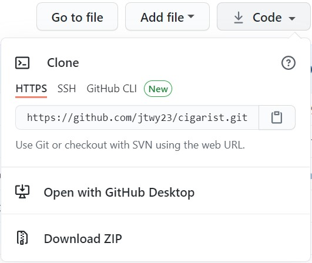

# CIGARIST

---


---

## Table of Contents
- [UX](#ux)
- [Strategy Plane](#strategy-plane)
- [Scope Plane](#scope-plane)
- [Structure Plane](#structure-plane)
- [Skeleton Plane](#skeleton-plane)
- [Surface Plane](#surface-plane)
- [Features](#features)
- [Technologies Used](#technologies-used)
- [Testing](#testing)
- [Responsive](#responsive)
- [Deployment](#deployment)
- [Credits](#credits)
- [Disclaimer](#disclaimer)

Cigarist is a cigar post and review site. Users can create their own post with reviews, read their own or other user posts, update their own posts and reviews and delete their own posts.
As a cigar enthusiast myself I often wonder if other people get the same flavours and aromas as I do or if they can get a completely different profile. This app was created to track what cigars I have tried and also to see other users reviews on cigars I may want to try in the future. On top of all that it allows me to test my theory on flavour profiles against other users flavour profiles. The website can be seen [here](https://cigarist.herokuapp.com/).

---

## UX

To develop this website we have broken down the UX into its five planes to define the client’s needs.

### Strategy Plane
| Client Goals:                                         | User Stories:                                                                                          |
|-------------------------------------------------------|--------------------------------------------------------------------------------------------------------|
| To create a site for users to post and review cigars. | As a user I would like to be able to see the site without registering.                                 |
| A site that allows users to discover new cigars.      | As a user I would like to register quickly and easily.                                                 |
| To have a simple and easy site for users to navigate. | As a user who is not registered I would like to be able to navigate  quickly to the registration page. |
| Create an online cigar community.                     | As a user I would like to be able to login quickly.                                                    |
|                                                       | As a user I would like to be able to create my own posts.                                              |
|                                                       | As a user I would like to be able to read my own posts and other users posts.                          |
|                                                       | As a user I would like to update my own posts.                                                         |
|                                                       | As a user I would like to delete my own posts.                                                         |
|                                                       | As a user I would like to have my own profile.                                                         |
|                                                       | As a user I would like to view all my own posts on my profile.                                         |
|                                                       | As a user I would like to upload an image with a url.                                                  |
|                                                       | As a user I would like to have the function to search for cigar brands, vitolas and is it hand made.   |

### Scope Plane
|     Features Included:    |            Future Feature Implementation:            |
|:-------------------------:|:----------------------------------------------------:|
| Navigation Bar            | User will be able to comment on posts.               |
| User Registration         | A button to like/favourite user posts.               |
| Sign In/Out Functionality | Ability to upload images without the use of the url. |
| Search Functionality      |                                                      |
| Adding Posts              |                                                      |
| Editing Posts             |                                                      |
| Deleting posts            |                                                      |
| Delete defence mechanism  |                                                      |

### Structure Plane
The website is designed to look simple and inviting. A user can get anywhere within one click. On an initial load to the page a user is immediately on the 'All Posts' page where they can see all other users posts. Should they choose to register it is as simple as looking to the top right side of the nav bar to register. If they are a registered user it is just as simple to login. Even if a new user accidentally clicks to the login page they can still navigate quickly to the registration page by scrolling to the bottom of the page. This is also true for existing users to login.

Once a user is logged in they will be directed straight to their own profile page where if they have already made posts will be able to see all their own posts. Also with the ability to edit or delete straight from the 'Profile' page.

While logged in user can easily browse through pages and can create, update and delete their own posts.

Finally a user can easily log out of their account by clicking on 'log out'.

### Skeleton Plane
The project wireframes were created with Balsamiq. We have created 3 versions of the website on different viewing 
platforms. Desktop, mobile and tablet view to show the client how the website will render on different devices.

- [Desktop](https://github.com/jtwy23/cigarist/blob/master/mockups/desktop.pdf)

- [Mobile](https://github.com/jtwy23/cigarist/blob/master/mockups/mobile.pdf)

- [Tablet](https://github.com/jtwy23/cigarist/blob/master/mockups/tablet.pdf)

### Surface Plane
To gain a simple and easy to read website the following design choices have been made.

- The font choice is 'Roboto'. For ease of reading to the user.

- White (#ffffff) text was used in the navbar titles to contrast with the orange (#ff9800) background.

- All H2 headings are also orange (#ff9800) to make the heading more impactful for the user.

- Black (#000000de) text was chosen for all the post text to keep easy on the eyes for the user against the white 
background.

- With the buttons 'Reset' and 'Delete' the color choice was a bright red (#f44336). Something simple to alert 
the user that when pressed it may have consequences. As with the 'Search' and 'Edit' buttons I have kept it to 
the orange (#ff9800) to keep in line with the sites color scheme.

- The modal box footer buttons have a similar color scheme. The 'Delete' button is still red (#f44336) but I have 
switched the 'Cancel' button to orange (#ff9800) to helps users relate to the sites color scheme.

---

## Features

-	The navigation is fixed to not distract the user from scrolling through posts. 
-	The images displayed on the 'Register' and 'Login' page is to allows users to know they are on a cigar related 
site.
-	There is a user registration form that new users can use to quickly sign up and start posting. It will also 
tell a new user if the username is already taken.
-	There is a  login and logout function. The login function is a form that checks who is trying to login and load 
up the users profile. The logout function is a click away and the user is safely logged out.
-	Logged in users have full search functionality on the 'All Posts' page should they want to search for the brand 
of cigar, vitola of the cigar or simply whether the cigar is hand made or not.
-	A javascript modal box was implemented to the 'Delete' button as defensive progamming. This will add an extra 
barrier for th euser when deleting posts or rather prevent them for deleting the wrong post.
-	The full project was built with a responsive design in mind. With this the user can view the site across all 
devices and screen sizes.

### Future Features
-	A feature that will be implemented in the future is for users to comment on their own or other users posts.
-	A button for users to like or favourite any posts they see and like.
-   The ability to be able to upload an image from any device that stores users images locally to the site. Rather 
than using the url of images a user can find online.

---

## Technologies Used
* [HTML5](https://en.wikipedia.org/wiki/HTML5)
    - The markup language used to structure and present the content onto the web.

* [CSS3](https://en.wikipedia.org/wiki/Cascading_Style_Sheets#CSS_3)
    - Used CSS to style the website.

* [Python version 3.8.6](https://www.python.org/)
    - Back end progamming language.

* [Click version 7.1.2](https://pypi.org/project/click/)
    - Command line creation kit.

* [DNS Python version 2.0.0](https://pypi.org/project/dnspython/)
    - DNS Toolkit.

* [Flask version 1.1.2](https://flask.palletsprojects.com/en/1.1.x/)
    - A WSGI micro framework.

* [Flask PyMongo version 2.3.0](https://flask-pymongo.readthedocs.io/en/latest/)
    - MongoDB support for Flask applications.

* [Its Dangerous version 1.1.0](https://itsdangerous.palletsprojects.com/en/1.1.x/)
    - Sends data to untrusted environments safely.

* [PyMongo version 3.11.2](https://pymongo.readthedocs.io/en/stable/)
    - A tool for Python to work with MongoDB.

* [Werkzeug version 1.0.1](https://pypi.org/project/Werkzeug/)
    - To generate password hash and to check password hash.

* [MaterialzeCSS version 1.0.0](https://materializecss.com/)
    - Front end framework.

* [Google Fonts](https://fonts.google.com/)
    - Used ['Roboto'](https://fonts.google.com/specimen/Roboto) 
    
* [Fontawesome](https://fontawesome.com/)
    - All icons were used from fontawesome.

* [jQuery](https://jquery.com/)
    - Modal box used for the 'Delete' button as a form of defensive progamming.

* [Balsamiq Wireframes](https://balsamiq.com/)
    - Used to create basic layout of the pages.

* [Unsplash](https://unsplash.com/)
    - Stock images used for the 'Register' and 'Login' pages.

* [Flaticon](https://www.flaticon.com/)
    - Favicon creator.

---

## Testing
For all testing results click [here](/TESTING.md)

## Deployment
The following are steps for project deployment.

### Requirements
- Github account
- Heroku account
- Python (version 3.8.6)
- MongoDB account

### Cloning the Repository
To work with a local copy of this project the following steps needs to be taken:

1. Go to the main page of the GitHub repository and click on the dropdown menu **Code**
![alt text][copy-clone]



2. Copy the URL and go to your local IDE

3. In the terminal of your IDE type in **git clone** and the paste the URL copied from step 2

4. Press Enter and the clone will be created


### Working with a Local Copy
To work with the local copy that is created follow steps below:

#### Step 1: Installing the Requirements
1. To install all the required libraries of the project go to the workspace of your local copy.

2. In the terminal window of your IDE type in: **pip3 install -r requirements.txt**


#### Step 2: Creating A Collection in MongoDB
1. Login to your MongoDB account

2. Create a **database** named 'cigarist'

4. Create two **collections** in the database named:

    - **cigarNotes**
        - **_id:**< ObjectId >
            - **cigarImage:**< string >
            - **cigarBrand:**< string >
            - **vitola:**< string >
            - **ringGauge:**< string >
            - **handMade:**< string >
            - **cigarStrength:**< string >
            - **cigarDraw:**< string >
            - **cigarFlavour:**< string >
            - **cigarAroma:**< string >
            - **cigarBurn:**< string >
            - **price:**< string >
            - **notes:**< string >
            - **created_by:**< string >

    - **users**
        - **_id:**< ObjectId >
            - **username:**< string >
            - **password:**< string >

#### Step 3: Setting Up the Environment Variables
1. Create a file called **.gitignore** in the root directory of your project.

2. Add the following text in your .gitignore file: **env.py**.

3. Create a file called **env.py**. This will contain all your environment variables.

4. Create your own personal secret key and password. In **env.py** add the following text as seen below and replace **YOURPASSWORD**, **YOUR-CLUSTER-NAME**, **YOUR-DATABASE-NAME** and **YOURSECRETKEY**

```
import os

app.config["MONGO_DBNAME"] = os.environ.get("MONGO_DBNAME")
app.config["MONGO_URI"] = os.environ.get("MONGO_URI")
app.secret_key = os.environ.get("SECRET_KEY")
```

#### Step 4: Run the App
1. Open your terminal window in your IDE
2. Type in **python3 app.py** to run the app


### Heroku Deployment
To host this project on Heroku please follow the steps below:

#### Step 1: 
1. Login to Heroku account.

2. Create a new app.

3. Select your region.

#### Step 2: Preparing Local Workspace for Heroku
1. Create a requirements.txt file in the terminal window of your local IDE type **pip3 freeze --local > requirements.txt**. This file is required so that Heroku knows which files needs to be installed.

2. Create a Procfile in the terminal window of your local IDE type **python app.py > Procfile**. This file is required so that Heroku knows which file is used as its entry point to get the app running.

#### Step 3: Pushing files to Heroku 
1. In the terminal window type in **heroku login** or **heroku login -i** and fill in your heroku credentials and password.

2. Commit all your files and **push** to your repository master.

#### Step 4: Setting the Configuration Variables in Heroku
1. Go back to your Heroku account and go to **settings**
2. Click on **Reveal Config Vars** to reveal the keys and the values
3. Set the keys and values as follow:
    (**KEY: VALUE**)
    - IP: 0.0.0.0
    - PORT: 5000
    - MONGO_DBNAME: YOUR-DATABASE-NAME
    - MONGO_URI: mongodb+srv://root:**YOURPASSWORD**@**YOUR-CLUSTER-NAME**.2qobt.mongodb.net/**YOUR-DATABASE-NAME**?retryWrites=true&w=majority
    - SECRET_KEY: YOURSECRETKEY

#### Step 5: Open App in Heroku
1. Click on **deploy** button on the Heroku dashboard.

2. Site has been deployed to Heroku.

## Disclaimer

This is only for educational purposes.

---