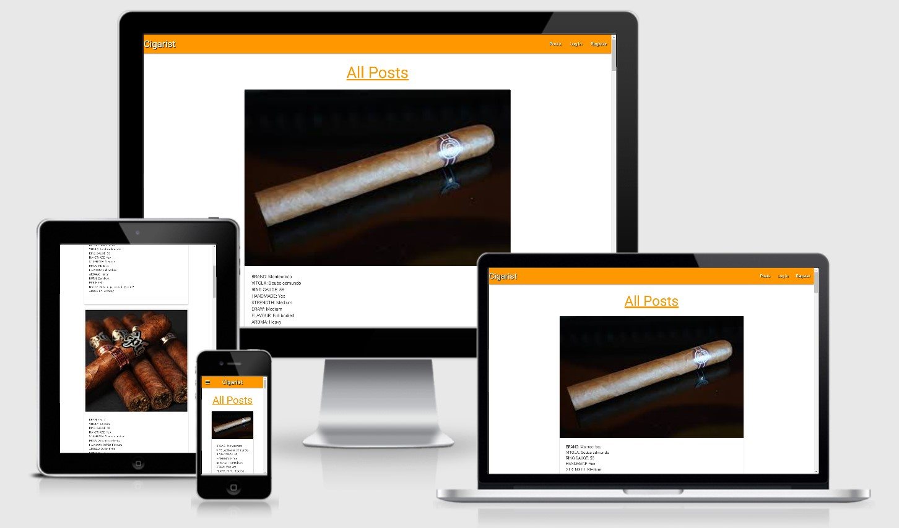

## Testing

### HTML5
All the HTML code was ran through [W3C Markup Validator](https://validator.w3.org/). Due to using Jinja templating
I had to test the HTML code by going to each individual page and right clicking on the page to 'View Page Source' on
Google Chrome before running my code in the html validator. As Python code is injected into the website the HTML
validator does not recognise this and throws up errors for a lot of the code. However, when I view the HTML code 
through 'View Page Source' all earlier errors disappear and I have no errors or faults in any of my pages.

---

### CSS
The style.css file was validated on [W3C CSS Validator](https://jigsaw.w3.org/css-validator/) with no errors.

---

### Javascript/jQuery

Running all the jQuery code through [JSHint](https://jshint.com/) there were no errors. 

---

## Responsive

The responsiveness of this website was tested using [Am I Responsive](http://ami.responsivedesign.is/#).

---

#### Navbar / Mobile Side Nav
The navbar and mobile side nav was tested. All links are clickable and land on to the correct pages. The Title 
is also clickable and returns the user back to the intended page. When on smaller screen sizes the bars icon appears
and when pressed loads the mobile side nav. Before login all a user will see is 'Posts', 'Login' and 'Register' 
headings. When a user is registered or logged in the headings will change to 'Posts', 'Profile', 'Add Post' and 
'Logout'. This functionality was tested by first using the site as a user and then signing in as a user. It works
well and I have tested this with multiple users.

#### add_post.html
On the add post page is where a user can upload their own reviews of the cigar. Every field within this section 
is required to be completed or the user cannot continue. When the field is completed with the minimum character 
count the field highlights green. If the field has not been filled or completed properly then the field will 
highlight red. This will help the user understand visually what is requiring a fix and what fields are correctly
completed. I tested this section by completing each field correct;y and with the minimum character count and also
the opposite to verify all fields react the way it was intended.

#### cigar_posts.html
This page is the main page a user lands on when logged in or as a new user. The user posts loads up as expected and 
is neatly stacked one on top of another on all screen sizes. The user that is logged in can see the 'Edit' and 
'Delete' buttons on their own posts, but other user posts do not display the buttons. The search bar works well. On 
testing it searches for all the categories I have set which are cigar brand name, vitola and wheter or not the 
cigar is hand made. These were the only search categories added because I felt that a user will be more likely to 
search on those key terms.

#### edit_posts.html
This page is very simialr to the add a post page. When the user clicks into edit their own post it they will be 
redirected to the edit post page where the user will see an already populated page with the current information
to view. This is so that the user will see exactly what they intend on editing. This was tested by logging into a
user profile and clicking the edit button and being taken to the page. On loading of the page all information on 
the current post is displayed. I then changed different parts of the post and update the post. Once changed I can
go to the posts page to see my changes or my profile page.

#### login.html
When logging in a user must input a username and a password they have on our database. If a user is not already
registered or inputs an incorrect username or password, then a message will flash up at the top of the page to let
the user know this. However if correctly logged in a user is taken to their own profile page. 
There is also a register link at the bottom of the login page. This can be used if a none registered user lands
accidentally on the login page and gives the user a chance to login and upload their own reviews.

#### profile.html
When a user succesfully logs in they are navigated to their own profile page. A user will know it is their own 
profile because they will have a welcome message with their own username in the message. Also every post the user 
has ever posted will be displayed on their profile page. If the user has never posted it will remain blank with only
the welcome message displaying.

#### register.html
Registering to cigarist is simple and easy. A user will only need to choose a unique username and password to
register. If they choose a username that already exists then a message will flash up at the top of the page and
the user will know to choose a new username.
There is also a login link at the bottom of the register page. This can be used if a registered user lands
accidentally on the register page and gives the user a chance to quickly get to the login page.

#### Social Media Icons
The three social media icons were tested by clicking on each icon. When pressed a new page is opened up and takes
the user to the intended social media platform.

---

### Browser Test

|      Browser      | Good | Bad |
|:-----------------:|:----:|:---:|
|   Google Chrome   |      |     |
|      Firefox      |      |     |
|       Opera       |      |     |
|       Safari      |      |     |
|        Edge       |      |     |
| Internet Explorer |      |     |

### Device Test

|    Device    | Good | Bad |
|:------------:|:----:|:---:|
|   Galaxy S5  |     |     |
|    Pixel 2   |     |     |
|  iPhone 5/SE |     |     |
| iPhone 6/7/8 |     |     |
|   iPhone X   |     |     |
|     iPad     |     |     |
|   iPad Pro   |     |     |
|  Surface Duo |     |     |

---
