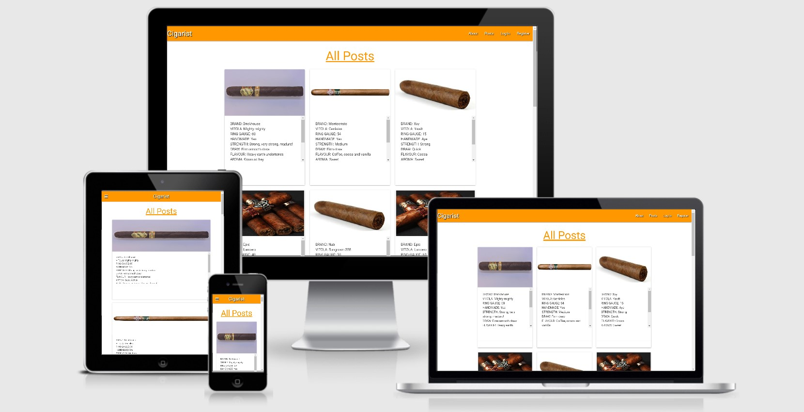

## Testing

### HTML5
All the HTML code was ran through [W3C Markup Validator](https://validator.w3.org/). All pages pages had errors when
validating. I realised that this was due to my python and jinja code. So when each page was loaded up on Chrome
I view the HTML code through 'View Page Source' all errors disappear and I have no errors or faults in my 
pages. 

---

### CSS
The style.css file was validated on [W3C CSS Validator](https://jigsaw.w3.org/css-validator/) with no errors.

---

### Javascript/jQuery

Running all the jQuery code through [JSHint](https://jshint.com/) there were no errors. 

---

### Python

All python code was checked on [PEP8 Online](http://pep8online.com/) where no errors were highlighted.

---

## Responsive

The responsiveness of this website was tested using [Am I Responsive](http://ami.responsivedesign.is/#).

To make sure that the site is responsive on all popular screen sizes. I ran it through 
[Am I Responsive](http://ami.responsivedesign.is/#) to check that it would look well in many different screen
sizes. It had the desired results. I tested this across numerous devices (using Chrome Dev Tools) and browsers. 
I had no problems from any of them.

Below are my findings on devices and browsers laid out in tables:

### Browser Test

|      Browser      | Responsive | Appearance | Functionality |
|:-----------------:|:----------:|:----------:|:-------------:|
|   Google Chrome   |     Yes    |    Good    |      Good     |
|      Firefox      |     Yes    |    Good    |      Good     |
|       Opera       |     Yes    |    Good    |      Good     |
|       Safari      |     Yes    |    Good    |      Good     |
|        Edge       |     Yes    |    Good    |      Good     |
| Internet Explorer |     Yes    |    Good    |      Good     |

### Device Test

|    Device    | Responsive | Appearance | Functionality |
|:------------:|:----------:|:----------:|:-------------:|
|   Galaxy S5  |     Yes    |    Good    |      Good     |
|    Pixel 2   |     Yes    |    Good    |      Good     |
|  iPhone 5/SE |     Yes    |    Good    |      Good     |
| iPhone 6/7/8 |     Yes    |    Good    |      Good     |
|   iPhone X   |     Yes    |    Good    |      Good     |
|     iPad     |     Yes    |    Good    |      Good     |
|   iPad Pro   |     Yes    |    Good    |      Good     |
|  Surface Duo |     Yes    |    Good    |      Good     |

---

## Pages

#### Navbar / Mobile Side Nav
The navbar and mobile side nav was tested. All links are clickable and land on to the correct pages. The title 
is also clickable and returns the user back to the intended page of home. On smaller screen sizes the bars icon appears
and when pressed loads the mobile side nav. Before login all a user will see is 'About' 'Posts', 'Login' and 'Register' 
headings. When a user is registered or logged in the headings will change to 'About' 'Posts', 'Profile', 'Add Post' and 
'Logout'. This functionality was tested by first using the site as a user and then signing in as a user. It works
well and I have tested this with multiple users.

#### about.html
The page loads as expected and the carousel displays all images properly. There are two links at the bottom of the 
card. If the user is new they have the option to click register which does take the user to the register page. Or if
the user has already registered then they can simply click login and be taken to their profile page after successfully
logging in. The links were tested and takes a user to the desired pages without any problems.

#### add_post.html
On the add post page is where a user can upload their own reviews of the cigar. Every field within this section 
is required to be completed or the user cannot continue. When the field is completed with the minimum character 
count the field highlights green. If the field has not been filled or completed properly then the field will 
highlight red. This will help the user understand visually what is requiring a fix and what fields are correctly
completed. I tested this section by completing each field correctly and with the minimum character count and also
the opposite to verify all fields react the way it was intended.

#### cigar_posts.html
This page is the main page a user lands on when logged in or as a new user. The user posts loads up as expected and 
is displayed in rows of three posts but will neatly stack one on top of another on smaller mobile screen sizes. The 
user that is logged in can see the 'Edit' and 'Delete' buttons on their own posts, but other user posts do not 
display the buttons. The edit button works well ans takes the user to the edit post page with all the post details
already populated for editing. The delete button when pressed takes the user to a modal box asking if they are sure
they want to delete with a further two buttons of delete and cancel. This is some defensive programming for users
to not accidentally delete their own post. When the user selects delete for the second time the post will be deleted
and taken off the database. However if the user presses cancel or even clicks outside of the modal box the action
is then cancelled and no post will delete.
The search bar works well. On testing it searches for all the categories I have set which are 
cigar brand name (eg. Montecristo or Brickhouse), vitola (eg. Robusto or Lancero) and whether or not the cigar is 
hand made (Only use a Yes or No search here). These were the only search categories added because I felt that a 
user will be more likely to search on those key terms. The Total posts counter that is displayed will show the 
amount post that have shown up in the search. But if there are no posts found in a user search then a message will
flash up saying to the user 'No Posts Found' but remains on the page with all the posts for the user to browse. On
successfull searchs then only the posts found will be displayed below the search box.

#### edit_posts.html
This page is very simialr to the add a post page. When the user clicks into edit their own post it they will be 
redirected to the edit post page where the user will see an already populated page with the current information
to view. This is so that the user will see exactly what they intend on editing. This was tested by logging into a
user profile and clicking the edit button and being taken to the page. On loading of the page all information on 
the current post is displayed. I then changed different parts of the post and update the post. Once changed I can
go to the posts page to see my changes or my profile page. The user is automatically navigated away to their own
profile page after a successful update of the post and a message telling the user 'Your Post is Updated' which will
tell the user they have definitely updated and there is no guessing.

#### login.html
When logging in a user must input a username and a password they have on our database. If a user is not already
registered or inputs an incorrect username or password, then a message will flash up at the top of the page to let
the user know this. However if correctly logged in a user is taken to their own profile page. 
There is also a register link at the bottom of the login page. This can be used if a none registered user lands
accidentally on the login page and gives the user a chance to login and upload their own reviews. When the register 
link is clicked it takes a user straight to the Register page.

#### profile.html
When a user succesfully logs in they are navigated to their own profile page. A user will know it is their own 
profile because they will have a welcome message with their own username in the message. Also every post the user 
has ever posted will be displayed on their profile page. If the user has never posted it will remain blank with only
the welcome message displaying.

#### register.html
Registering to cigarist is simple and easy. A user will only need to choose a unique username and password to
register. If they choose a username that already exists then a message will flash up at the top of the page and
the user will know to choose a new username.
There is also a login link at the bottom of the register page. This can be used if a registered user lands
accidentally on the register page and gives the user a chance to get to the login page.

#### 404.html
A custom 404 error page is created for when users try to go to a page that doesn't exist. The page offers the user
information that tells them the page does not exist and also a link at the buttom to return to the homepage. The link
worls well and when clicked takes the user back to the all posts page.

#### Social Media Icons
The three social media icons were tested by clicking on each icon. When pressed a new page is opened up and takes
the user to the intended social media platform.

---

## Testing User Stories

1. As a user I would like to be able to see the site without registering.
    - As soon as a user lands on the main page you will be able to see all users posts. Even if the current user
    has not been logged in or registered. This allows new users to decide if they would like to join the site or not.

2. As a user I would like to register quickly and easily.
    - A new user simply needs to navigate to the register page choose a username and password and sign up. However 
    if the user chooses a username already being used they will be told with a message at the top of their screen
    that the username is taken. The user will need to then choose a new username.

3. As a user who is not registered I would like to be able to navigate quickly to the registration page. 
    - When a new user lands onto the site they will be able to see the word 'Register' at the top right corner on 
    desktop and tablet view and on mobile view to simply click the bars icon and the 'Register' tab is very clear 
    at the bottom. Once clicked the user is navigated straight to the register page.

4. As a user I would like to be able to login quickly.
    - Registred users can login quickly by landing on the main page and selecting login which is at the top. When 
    clicked the user is taken to a simple login page that authorises the login details and takes the user direct to
    their profile page.

5. As a user I would like to be able to create my own posts. 
    - A registered user can easily create their own posts. Once logged in they can go to the add post tab where they 
    can input all the cigar details for their post as well as add an image url to show the cigar they are posting
    about.

6. As a user I would like to be able to read my own posts and other users posts. 
    - All registered users can read all their own posts as well as other users posts. Users will be able to know it 
    is their own posts because they will see buttons which give the user the option to edit a post of delete the post.
    However if it is not their own posts they will not be given theses options.

7. As a user I would like to update my own posts.  
    - Users who are registered can update their posts. All users own posts can see an edit button either on the main page
    or on their own profile page. With a click of the button the user will navigate to the edit post page where it
    will be populated with all the information of the post and the user can decide what needs to be changed and reposted
    afterwards.

8. As a user I would like to delete my own posts.
    - Users are able to delete their own posts if they do not want it to remain on the site. Every post a user puts 
    up will have a delete button. The delete button has defensive progamming built in so that the user does not delete
    a post by accident. When the button is pressed a javascript modal box pops up and will ask the user if they 
    would really like to delete the post. There are two footer buttons which will allow the user to choose to delete or
    cancel the deletion. There is an additional action where a user can simply click outside the modal box that also
    cancels out the deletion.

9. As a user I would like to have my own profile.
    - User who have registered are given personal profile pages. Here they can access all their own posts. They have 
    the options to edit posts and choose to delete them as well.

10. As a user I would like to view all my own posts on my profile. 
    - Users on their own profile page will be shown all posts they have created.

11. As a user I would like to upload an image with a url.
    - All users can uplaod their own images to their post by inserting the image url to show other users the cigar.

12. As a user I would like to have the function to search for cigar brands, vitolas and is it hand made. 
    - The search bar is always located on the main page for users to search for more specific posts. Users can search
    by cigar brands, vitolas or whether or not it is hand made.

13. As a user I would like to see social media links on the site for easy access.
    - At the bottom of every page are the social media icons that a user can press and be taken to a new page that
    takes the user to the social media platform they have clicked on.

14. As a user I would like to know what the purpose of the site is for. 
    - The about.html page gives users a brief description of what the purpose of the website is and some short
    instructions on how to register, login and add posts.

---

## Bugs

1. On building the app the first bug I came across was linking the database to the cigar post page. 
    - This was fixed with correcting the app.py file. I had to render the correct page because I had named the view
    one thing and the page another I had gotten myself mixed up. But once I recognised the problem I managed to fix
    this right away.

2. At the start of this project I wanted to use the icons provided in materialize which are icons from Google icons.
    - I had to replace Google icons with Fontawesome icons. This was because there is a shortage of icons from
    Google and made it very hard to work with. Therefore changing to Fontawesome was the best way forward.

3. There was an import issue from Flask.
    - Flask was not importing the unique usernames onto the page. I had forgotten to import the 'Import' function.
    As soon as I imported the function all usernames were displaying properly.

4. Images not rendering properly on all posts page.
    - When displaying the url images they were coming in to all different sizes. I started with a hard coded sizes
    which would only work some of the time. However Materialize has a repsonsive image class which fixed my problem.

5. The search functionalty was not displaying the proper searches.
    - The problem here was the same as my first bug problem. I did not stick with the correct naming conventions.
    This led to me being confused and the search did not display as expected.

6. Deleting a user post was not deleting the intended post but the very first post the user had.
    - As I was using the modal box as an added layer for defensive programming I had forgotten to include the unique
    ._id names into the modal. So all it was doing was deleting the posts in order rather than deleting the selected
    post. Since adding the unique id's I am now able to delete the appropriate posts.

7. When I was changing the look of the home page from stacked posts to a three in a row display of posts I ran into
a problem with the main text. Some was displayed and the rest were sitting behind the buttons.
    - This was rectified by using overflow-y: auto !important. The text was much better contained and a user can 
    now scroll through the text to see what was posted.

8. The edit and delete buttons were originally stacked to stay inline with the stacked design. However the buttons 
were cause problems with displaying more text.
    - I made the buttons inline so that more text can be shown.

9. Adding drop down menus into the add_post.html was a problem due to Materialize's own css. Their property of display
is set to hidden. So the validation didn't work.
    - The fix was from the Flask mini project jQuery code that allowed the vaidation to work correctly.

10. When testing the edit_post.html page I noticed on Apple devices there was an additional caret below each sub-heading
which did not meant to show up on Chrome Dev Tools.
    - The fix was adding -webkit-appearance: none so Apple OS does not render the caret unexpectedly. Once this 
    property was included the caret was no longer visble and works well on iOS devices.
    
---
